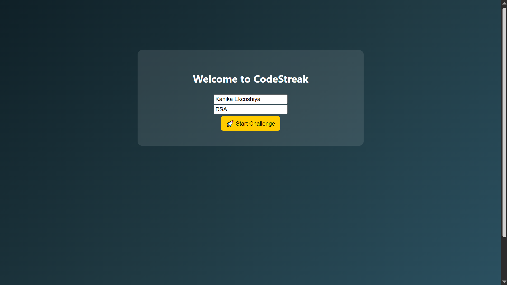
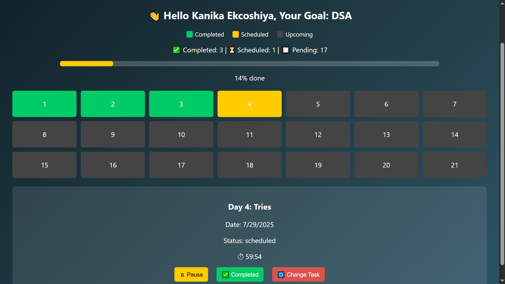
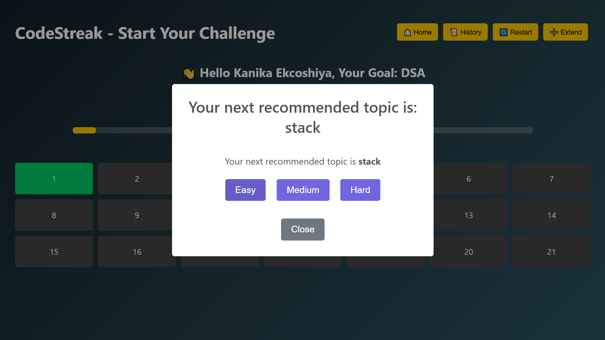
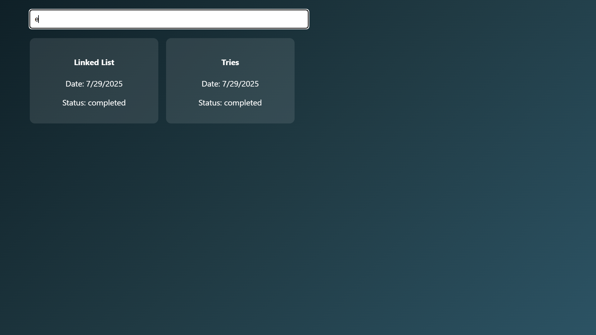
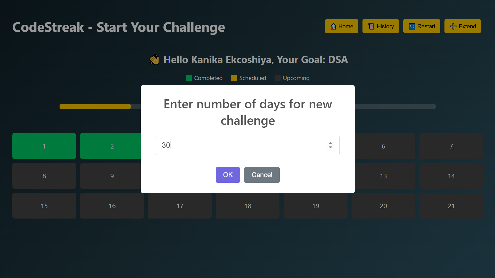
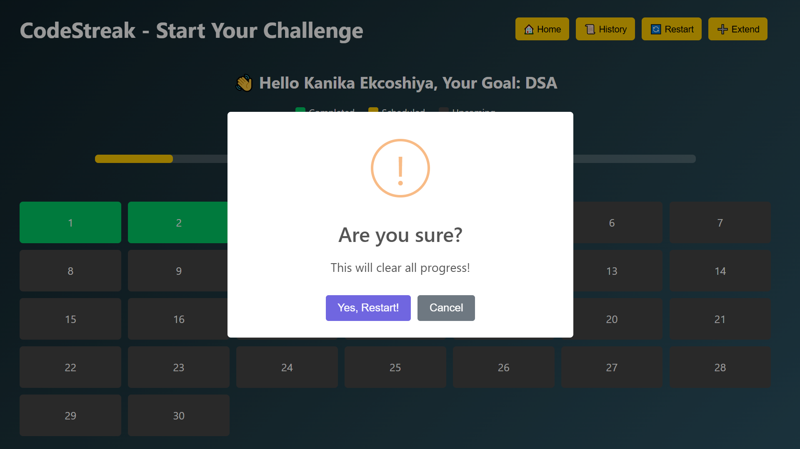

# CodeStreak - Challenge Tracker  

CodeStreak is a web-based application that helps students track and complete challenges, including but not limited to DSA (Data Structures & Algorithms). Students can set their own goals (like DSA, coding practice, or any other learning task), track progress day by day, and extend their challenge beyond 21 days if they wish.  

# Live Demo  
🔗 [View Deployed Project]https://codestreak-z551.vercel.app/

# Features  
- Add daily tasks with a timer and mark them as completed.  
- Students can track **any type of goal**, not just DSA.  
- Color-coded grid for scheduled, completed, and upcoming tasks.  
- Option to **extend the challenge** to more than 21 days.  
- Pop-ups with success and failure notifications.  
- If tasks are related to **DSA topics**, students receive recommended next topics and direct practice links (Easy, Medium, Hard).  
- For non-DSA goals, recommendations and practice links will not be shown.  
- Task history with dates and search functionality. 
- Student can also **Restart** the challenge which will clear all their saved tasks and everything will continue from start. 
- Fully responsive design for mobile, tablet, and desktop.  

# Tech Stack  
- **React.js**  
- **JavaScript** 
- **HTML (JSX in React)**  
- **CSS**  
- **LocalStorage** (to save user data on the device)  
- **SweetAlert2** (pop-ups)  
- **Vercel** (deployment)  

# How It Works  
1. Enter your **name** and **goal** when starting.  
2. Add daily tasks by selecting a day and setting a topic with a timer.  
3. You can pause, resume, or complete tasks anytime.  
4. Mark tasks as completed to track progress and, for DSA tasks, view recommended next topics.  
5. Extend your challenge if you want to continue beyond 21 days.  
6. View your entire history with search and dates.  

# Screenshots  

1. **Home Page**  
     

2. **Tasks Grid**  
     

3. **Recommendation And Practice (DSA only)**  
     

4. **History Page**  
    

5. **SearchInHistory Page**  
     
   
6. **ExtendDays Page**  
    

7. **Restart Page**  
   

## Installation

1. Clone the repository:

   ```bash
   git clone https://github.com/Kanikaekcoshiya/codestreak.git
2. Install dependencies and start the project:
- npm install  
- npm start  

3. Build for production:
-npm run build  

# Deployment
- The app is deployed using Vercel.

- Every push to the main branch will automatically deploy the latest version.

# Data Privacy Note
- All user data (name, tasks, and history) is stored in the browser's LocalStorage.

- This data stays only on the user’s device and cannot be viewed by others.

# License
This project is for educational purposes only.

# Contact:
Made by Kanika Ekcoshiya 
Email: kanikaekcoshiya@gmail.com


